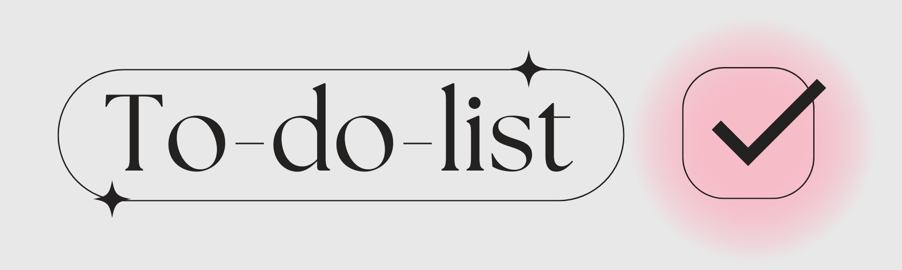
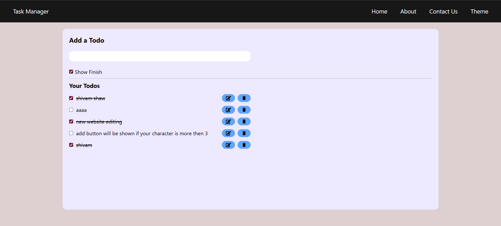

<!-- Banner Section -->

  

<h1 align="center">📝 ToDo List Web App</h1>

  A sleek, fully responsive ToDo List application built using <strong>Vite + React + Tailwind CSS</strong>.
  Manage your daily tasks efficiently with local storage support.

---

### 🔗 Live Demo

- 🌐 **Website**: [Live ToDo App](https://your-deployed-link.vercel.app/)
- 🎥 **Demo Video**: [Watch on LinkedIn](https://www.linkedin.com/posts/shivam-shaw-a9288a272_todolist-i-am-pleased-to-present-a-task-activity-7300082650453577728-MR86?utm_source=share&utm_medium=member_android&rcm=ACoAAEKxkY4BHUKw7WO7MmBrm7oYFy5o8-LY1HI)

---

### 🚀 Features

- ✅ Add new tasks
- ✏️ Edit existing tasks
- ❌ Delete tasks
- 💾 Persistent storage using **LocalStorage**
- 📱 Fully responsive for all screen sizes
- ⚡ Lightning-fast loading with **Vite**

---

### 🧰 Tech Stack

- ⚛️ React (with Hooks)
- ⚡ Vite (Frontend Tooling)
- 🎨 Tailwind CSS (Utility-first styling)
- 💻 LocalStorage (Data Persistence)

---

### 📸 Screenshots

  

📁 Folder Structure

      todo-app/
      ├── public/
      ├── src/
      │   ├── components/
      │   ├── App.jsx
      │   └── main.jsx
      ├── tailwind.config.js
      ├── index.html
      └── README.md
💡 How to Use
  1. Clone the repository:
     
    git clone https://github.com/shivamwebsite/Todo-List.git
    cd Todo-List
  2.Install dependencies:

    npm install
  3.Start the development server:

    npm run dev
